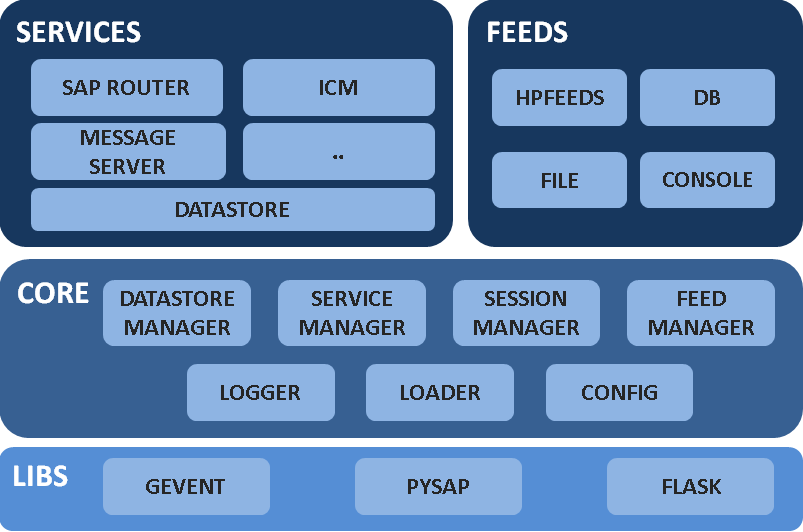

.. Introduction chapter frontend

Introduction
============

Objective
---------

HoneySAP is a low-interaction research-focused honeypot specific for SAP
services. The main objective is to allow security profesionals, researchers and
organizations lear about the techniques and motivations behind attacks against
SAP systems.

The goals set for this project are:

* Have a specific purpose honeypot for SAP services.
* Be able to identify the behaviour of those attacking SAP systems.
* Be flexible and allow deployment of different scenarios.
* Allow easy extension and improvement of the software.

Design principles
-----------------

The main design principles considered when developing the software are:

Extendible
^^^^^^^^^^

It should be easy to extend the honeypot by adding new services, new mechanisms
of sharing the information (feeds) or other components.

Modular
^^^^^^^

Functionality should be implemented in a modular way allowing the plugin or
plugout of the different components. Modules should be configurable as much as
possible.

Easy configuration
^^^^^^^^^^^^^^^^^^

Configuration should be as easier as possible in order to allow customization
of the different services and core components.

Easy deployment
^^^^^^^^^^^^^^^

Deployment should be as easier as possible in order to allow developers and
system administrators without extensive knowledge about honeypots or SAP to run
the software in their environments.

Architecture
------------

The following diagram shows the main components of HoneySAP:

